lattice-tools
================
Michael Jahn,
2023-09-05

<!-- badges start -->

[](https://github.com/m-jahn/lattice-tools/actions)
[](https://github.com/m-jahn)


<!-- badges end -->

------------------------------------------------------------------------

Panel functions and wrappers that extend the R lattice universe

## Description

This package contains panel functions and themes for the R `lattice`
package, a general purpose plotting package from Deepayan Sarkar.
Lattice’s functionality is comparable to the popular `ggplot2` package
but has a slightly different look and feel. The functions in this
package adhere as far as possible to the `lattice` conventions but might
in some cases deviate from default behavior. However, some care was
taken to replicate the original lattice behavior so that users can apply
grouping and paneling as they are used to. Feel free to copy, fork or
source functions that you find useful. Contributions welcome!

## Installation

To install the package directly from github, use this function from the
`devtools` package in your R session:

``` r
require(devtools)
devtools::install_github("https://github.com/m-jahn/lattice-tools")
```

## Panel functions

These functions extend or simplify the `panel.function` landscape for
`lattice`.

### panel.annotate

Draw summary text labels in lattice plots. This panel function allows to
draw text labels such as the mean on arbitrary groups of data points.
Text labels will be drawn for groups of identical x values with optional
subsetting by grouping or paneling variables. This function complements
`panel.errbars()` and `panel.barplot` as it supports drawing labels
beside each other for different groups.

``` r
library(lattice)
library(latticetools)
data(mtcars)

# annotate mean values
xyplot(mpg ~ factor(cyl) | factor(vs), mtcars,
  lwd = 2, pch = 19, offset = 2, digits = 1,
  panel = function(x, y, ...) {
    panel.errbars(x, y, ...)
    panel.annotate(x, y, ...)
  }
)
```

<!-- -->

``` r
# works also with grouping variable. Takes the same arguments
# "beside" and "ewidth" as panel.errbars() and panel.barplot()
# to plot labels for different groups aside of each other
xyplot(mpg ~ factor(cyl) | factor(vs), mtcars,
  lwd = 2, pch = 19, groups = gear, digits = 1,
  offset = 3, beside = TRUE,
  panel = function(x, y, ...) {
    panel.errbars(x, y, ...)
    panel.annotate(x, y, ...)
  }
)
```

<!-- -->

### panel.arrowbox

Panel function to draw boxes with arrow head from 2 XY coordinates and
direction argument. Each argument can be a vector of same length so that
multiple arrows can be drawn at once. Is internally used in
`panel.geneplot`.

``` r
library(lattice)

xyplot(1:3 ~ 4:6, col = "#0080ff",
  panel = function(x, y, ...) {
    panel.arrowbox(x0 = c(4, 5), y0 = c(2.5, 1),
      x1 = c(5, 6), y1 = c(3, 1.5),
      direction = c(1, -1), ...)
  }
)
```

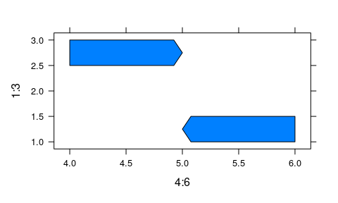<!-- -->

### panel.barplot

Draw a barplot with error bars in lattice plots. This panel function
allows to draw barplots with error bars for arbitrary groups of data
points. Error bars will be drawn for groups of identical x values with
optional subsetting by grouping or paneling variables. This function is
very similar to `panel.errbars` only with bars instead of points.

``` r
# mean and stdev error bars are drawn for
# common x values
xyplot(mpg ~ factor(cyl), mtcars, lwd = 2, 
  panel = function(x, y, ...) {
    panel.barplot(x, y, ...)
  }
)
```

<!-- -->

``` r
# using the same variable for x and grouping will
# result in typical lattice behavior
xyplot(mpg ~ factor(cyl), mtcars, 
  groups = cyl, lwd = 2,
  panel = function(x, y, ...) {
    panel.barplot(x, y, ...)
  }
)
```

<!-- -->

``` r
# we can also use different variables for the x var, grouping,
# and paneling. As a visual control that error bars are drawn
# for the correct groups we overlay the single data points.
xyplot(mpg ~ factor(cyl) | factor(vs), mtcars,
  groups = gear, lwd = 2, auto.key = list(columns = 3),
  panel = function(x, y, ...) {
    panel.barplot(x, y, beside = TRUE, draw_points = TRUE, ...)
  }
)
```

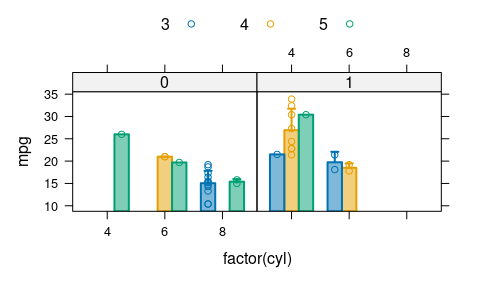<!-- -->

``` r
# alternatively, means and error margins can be supplied directly. 
# In this case means are supplied as unique combinations
# of y and x while error_margin is a separate vector with same length as y.
mtcars_means <- data.frame(
  cyl = sort(unique(mtcars$cyl)),
  mpg = with(mtcars, tapply(mpg, cyl, mean)),
  stdev = with(mtcars, tapply(mpg, cyl, sd))
)

# you might have to adjust the y-scale as it is determined from the
# range of the y variable only, ignoring the extension through error bars.
xyplot(mpg ~ factor(cyl), mtcars_means,
  error_margin = mtcars_means$stdev,
  ylim = c(9, 36), groups = cyl,
  lwd = 2, pch = 19, cex = 1.5,
  panel = function(x, y, ...) {
    panel.barplot(x, y, ...)
  }
)
```

<!-- -->

``` r
# if you supply a two column matrix as the error_margin argument,
# error bars with different lower and upper bounds can be drawn
error_mat <- matrix(ncol = 2, 1:6)
xyplot(mpg ~ factor(cyl), mtcars_means,
  error_margin = error_mat, twoway = TRUE, fill = NA,
  ylim = c(9, 36), groups = cyl,
  lwd = 2, pch = 19, cex = 1.5,
  panel = function(x, y, ...) {
    panel.barplot(x, y, ...)
  }
)
```

<!-- -->

### panel.beeswarm

Panel function for beeswarm plots. This panel function works essentially
like a stripplot, but instead of randomly scattering a variable produces
a regular, grid-like pattern of points. Currently only the X variable is
transformed. Continuously distributed data points can be optionally
discretized, both for X and for Y variable.

``` r
# simple example
df <- data.frame(
  Y = sample(1:10, 60, replace = TRUE), 
  X = factor(rep(1:3, each = 20))
)

# beeswarm plot
xyplot(Y ~ X, df, groups = X, panel = panel.beeswarm)
```

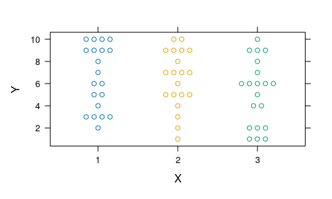<!-- -->

``` r
# but with continuous Y variable, it doesn't work as expected
df$Y <- rnorm(60)
xyplot(Y ~ X, df, groups = X, panel = panel.beeswarm)
```

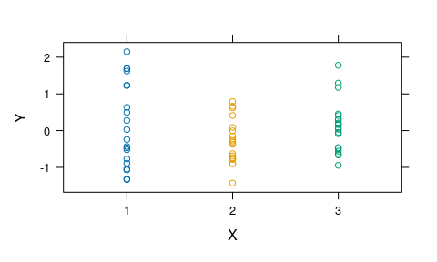<!-- -->

``` r
# for this purpose we can bin the Y variable into groups
xyplot(Y ~ X, df, groups = X, 
  panel = function(x, y, ...) {
    panel.beeswarm(x, y, bin_y = TRUE, breaks_y = 10, ...)
})
```

<!-- -->

``` r
# the breaks for Y bins are computed for each panel independently.
# we can also supply fixed bins via the 'breaks_y' argument
# to obtain the same binning for each panel
xyplot(Y ~ factor(rep(1, length(Y))) | X, df, groups = X,
  panel = function(x, y, ...) {
    panel.beeswarm(x, y, bin_y = TRUE,
      breaks_y = seq(-4, 4, length.out = 20), ...)
})
```

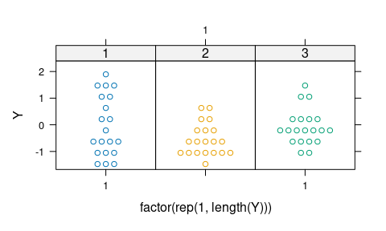<!-- -->

### panel.directlabels

Point labels for scatterplots. Draw text labels for all points of a
scatterplot using internal functionality from the `directlabels`
package. Note: an alternative panel function, `panel.repellabels`, is a
wrapper using ggrepel calculated label positions instead. The same
behavior can be achieved by using “ggrepel” for the `positioning`
argument.

In contrast to the original `directlabels` package, *every point* is
labeled instead of groups of points. Labels are also independent from
the grouping variable, so that e.g. colors indicate one grouping
variable and labels another. By default, labels adapt the graphical
parameters of the higher level plot, including coloring according to
groups. However, many parameters can be customized.

``` r
library(grid)
library(lattice)

data("mtcars")
mtcars$car <- rownames(mtcars)

# A standard example using lattice grouping and paneling;
# We can also draw boxes around labels and change label size
xyplot(mpg ~ wt | factor(cyl), mtcars,
  groups = cyl, pch = 19, labels = mtcars$car,
  as.table = TRUE, layout = c(3, 1), cex = 0.6,
  panel = function(x, y, ...) {
    panel.xyplot(x, y, ...)
    panel.directlabels(x, y, draw_box = TRUE, box_line = TRUE, ...)
  }
)
```

<!-- -->

``` r
# A similar plot but without grouping. This requires explicit
# use of subscripts
xyplot(mpg ~ wt | factor(cyl), mtcars,
  pch = 19, labels = mtcars$car,
  as.table = TRUE, layout = c(3, 1), cex = 0.6,
  panel = function(x, y, subscripts, ...) {
    panel.xyplot(x, y, ...)
    panel.directlabels(x, y, subscripts = subscripts, 
      draw_box = TRUE, box_fill = "white", ...)
  }
)
```

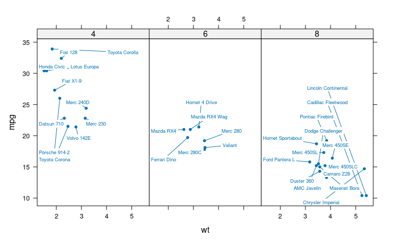<!-- -->

``` r
# An example without panels and more groups
xyplot(mpg ~ wt, mtcars,
  groups = hp, pch = 19, 
  labels = mtcars$wt, cex = 0.6,
  panel = function(x, y, ...) {
    panel.xyplot(x, y, ...)
    panel.directlabels(x, y, draw_box = TRUE, box_line = TRUE, ...)
  }
)
```

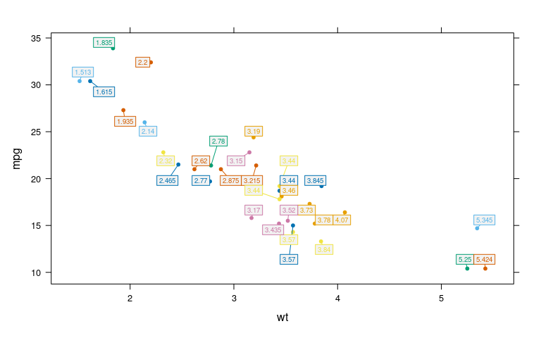<!-- -->

### panel.dumbbell

Make a dumbbell chart. Similar to a lollipop chart that shows a single
point supported by a horizontal or vertical line, the dumbbell chart
shows the minimum and maximum of a distribution connected by a line. The
direction of the dumbbell (i.e. vertical or horizontal) can be specified
manually, or it is determined from the data automatically (the default).

``` r
library(lattice)
data(mtcars)

# vertical dumbbells
xyplot(mpg ~ factor(gear), mtcars,
  groups = gear,
  pch = 19, lwd = 2,
  panel = function(x, y, ...) {
    panel.dumbbell(x, y, ...)
  }
)
```

<!-- -->

``` r
# horizontal dumbbells
xyplot(factor(gear) ~ mpg, mtcars,
  groups = gear,
  pch = 19, lwd = 2,
  panel = function(x, y, ...) {
    panel.dumbbell(x, y, ...)
  }
)
```

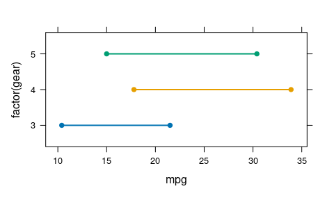<!-- -->

### panel.errbars

Draw error bars in lattice plots. This panel function allows to draw
symbols with error bars for arbitrary groups of data points. Error bars
will be drawn for groups of identical x values with optional subsetting
by grouping or paneling variables. This function is very similar to
`panel.barplot` only with points instead of bars.

``` r
library(lattice)
data(mtcars)

# mean and stdev error bars are drawn for
# common x values
xyplot(mpg ~ factor(cyl), mtcars, 
  lwd = 2, pch = 19, cex = 1.5,
  panel = function(x, y, ...) {
    panel.errbars(x, y, ...)
  }
)
```

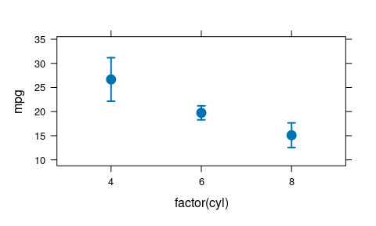<!-- -->

``` r
# using the same variable for x and grouping will
# result in typical lattice behavior
xyplot(mpg ~ factor(cyl), mtcars,
  groups = cyl, lwd = 2, pch = 19, cex = 1.5,
  panel = function(x, y, ...) {
    panel.errbars(x, y, ...)
  }
)
```

<!-- -->

``` r
# we can also use different variables for the x var, grouping,
# and paneling.
xyplot(mpg ~ factor(cyl) | factor(vs), mtcars,
  groups = gear, lwd = 2, pch = 19, cex = 1.5,
  panel = function(x, y, ...) {
    panel.errbars(x, y, beside = TRUE, ...)
  }
)
```

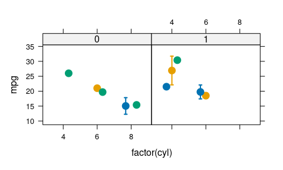<!-- -->

``` r
# alternatively, means and error margins can be supplied directly. 
# In this case means are supplied as unique combinations
# of y and x while error_margin is a separate vector with same length as y.
mtcars_means <- data.frame(
  cyl = sort(unique(mtcars$cyl)),
  mpg = with(mtcars, tapply(mpg, cyl, mean)),
  stdev = with(mtcars, tapply(mpg, cyl, sd))
)

# you might have to adjust the yscale as it is determined from the
# range of the y variable only, ignoring the extension through error bars.
xyplot(mpg ~ factor(cyl), mtcars_means,
  error_margin = mtcars_means$stdev,
  ylim = c(9, 36), groups = cyl,
  lwd = 2, pch = 19, cex = 1.5,
  panel = function(x, y, ...) {
    panel.errbars(x, y, ...)
  }
)
```

<!-- -->

``` r
# if you supply a two column matrix as the error_margin argument,
# error bars with different lower and upper bounds can be drawn
error_mat <- matrix(ncol = 2, 1:6)
  xyplot(mpg ~ factor(cyl), mtcars_means,
  error_margin = error_mat,
  ylim = c(9, 36), groups = cyl,
  lwd = 2, pch = 19, cex = 1.5,
  panel = function(x, y, ...) {
    panel.errbars(x, y, ...)
  }
)
```

<!-- -->

### panel.geneplot

Plot genes along a linear axis. This panel function allows to draw genes
with start and end coordinates as main input. Optional vectors for
`gene_name` or `gene_strand` must have same length as `x`, `y`. This
function supports paneling and grouping (e.g. by gene functional
category) just as regular panel functions.

``` r
library(lattice)

# table with dummdy genetic loci
genes <- data.frame(
  gene_name = c("abc", "def", "ghi", "jkl"),
  gene_strand = c("+", "+", "+", "-"),
  gene_start = c(123, 178, 245, 310),
  gene_end = c(167, 233, 297, 354)
)
 
# plot genes on a linear map
xyplot(gene_end ~ gene_start, genes,
  groups = gene_strand,
  scales = list(y = list(draw = FALSE)),
  xlim = c(80, 380), ylim = c(-3,2),
  xlab = "", ylab = "",
  gene_strand = genes[["gene_strand"]],
  gene_name = genes[["gene_name"]],
  panel = function(x, y, ...) {
    panel.grid(h = -1, v = -1, col = grey(0.9))
    panel.geneplot(x, y, arrows = TRUE, ...)
  }
)
```

<!-- -->

``` r
# same example with customized arrows
xyplot(gene_end ~ gene_start, genes,
  groups = gene_strand,
  scales = list(y = list(draw = FALSE)),
  xlim = c(80, 380), ylim = c(-3,2),
  xlab = "", ylab = "",
  gene_strand = genes[["gene_strand"]],
  gene_name = genes[["gene_name"]],
  panel = function(x, y, ...) {
    panel.grid(h = -1, v = -1, col = grey(0.9))
    panel.geneplot(x, y, arrows = TRUE, offset = 0.5,
      height = 0.6, rot_labels = 0, tip = 3, col_labels = 1, ...)
  }
)
```

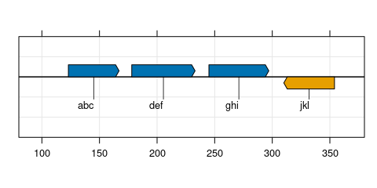<!-- -->

### panel.key

Draw custom keys in lattice plots. This panel function allows to draw a
key (legend) inside a lattice panel, with more customization options
than the lattice default.

``` r
library(lattice)
data(mtcars)

# Two examples for a custom lattice key inside a panel.
# The first takes all arguments from the 
# top-level plotting function.
# The second has custom arguments.
xyplot(mpg ~ 1/wt | factor(vs), mtcars,
  groups = carb, pch = 19,
  panel = function(x, y, ...) {
    panel.xyplot(x, y, ...)
    panel.key(...)
    panel.key(labels = letters[1:5], which.panel = 2, 
      corner = c(0.9, 0.1), col = 1:5, pch = 1:5)
  }
)
```

<!-- -->

### panel.lollipop

Make a lollipop chart. This panel function creates lollipop charts. A
lollipo chart is simply an XY-plot where the single points are supported
by a horizontal or vertical line originating from one of the axes, or a
specified threshold.

``` r
library(lattice)
data(mtcars)
mtcars$car <- rownames(mtcars)

xyplot(mpg ~ factor(car, car[order(mpg)]), mtcars[1:10, ],
  pch = 19, xlab = "", lwd = 2,
  scales = list(x = list(rot = 35)),
  panel = function(x, y, ...) {
    panel.lollipop(x, y, ...)
  }
)
```

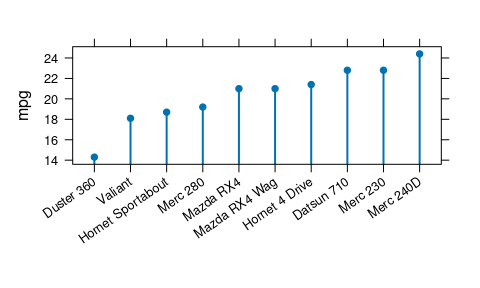<!-- -->

``` r
# with grouping, and lollipops hanging from top
xyplot(mpg ~ factor(car, car[order(mpg)]), mtcars[1:10, ],
  groups = gear, pch = 19, xlab = "", lwd = 2,
  scales = list(x = list(rot = 35)),
  panel = function(x, y, ...) {
    panel.lollipop(x, y, origin = "top", ...)
  }
)
```

<!-- -->

### panel.piechart

Draw pie and ring charts in lattice plots. This panel function allows to
draw pie charts (or rings) while still being able to use the typical
lattice way of subsetting data. The function can be used within
`xyplot()` but only one variable needs to be supplied (`x`). Grouping is
supported in the sense that the `x` variable is aggregated (summed up)
over each unique group.

``` r
library(grid)
library(lattice)

data("USMortality")

# A simple example using lattice paneling
xyplot( ~ Rate | Sex, USMortality,
  main = "US mortality rates by sex",
  scales = list(draw = FALSE), cex = 0.7,
  panel = function(x, ...) {
    panel.piechart(x, ...)
  }
)
```

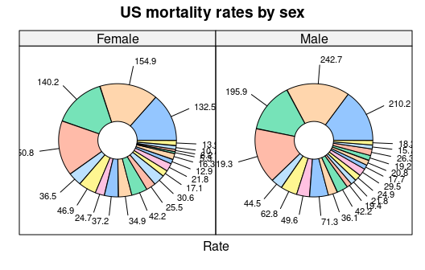<!-- -->

``` r
# A more advanced example using grouping and
# adjusting graphical parameters. The main variable 
# 'x' is now summed up for each value of 'groups'
xyplot( ~ Rate | Sex, USMortality,
  groups = gsub(" ", "\n", Cause), 
  col = heat.colors(10),
  border = grey(0.3), cex = 0.7,
  main = "US mortality rates by sex",
  scales = list(draw = FALSE),
  panel = function(x, ...) {
    panel.piechart(x, diameter_sector = 0.1, ...)
  }
)
```

<!-- -->

### panel.pvalue

Calculate and draw p-values in lattice plots. This panel function allows
to overlay p-values obtained from a statistical significance test on
plots, together with “significance” symbols such as stars as it is often
in encountered in the scientific literature. By default, the function
applies Student’s (2-sided) `t.test` to each pair of a unique X variable
and a standard. By default, the standard is the first unique value of X,
but can be specified manually.

``` r
library(lattice)
data(mtcars)

# p-values are calculated between groups of x, grouping is ignored
xyplot(mpg ~ factor(cyl), mtcars, groups = cyl, pch = 19, cex = 0.7,
  panel = function(x, y, ...) {
    panel.stripplot(x, y, jitter.data = TRUE, 
      horizontal = FALSE, amount = 0.15, ...)
    panel.pvalue(x, y, std = 1, symbol = TRUE,
      pvalue = TRUE, offset = 6)
})
```

<!-- -->

### panel.quadrants

Draw quadrants and quadrant statistics in lattice plots. This panel
function allows to draw custom quadrants and display additional quadrant
statistics as often used in biomedical sciences. Grouping is ignored.

``` r
library(lattice)
data(mtcars)

# Default behavior for quadrants is to split x and y data
# at the respective median, and plot percentage of points 
# per quandrant
xyplot(mpg ~ 1/wt | factor(vs), mtcars,
  groups = carb, pch = 19, cex = 1,
  panel = function(x, y, ...) {
    panel.xyplot(x, y, ...)
    panel.quadrants(x, y, ...)
  }
)
```

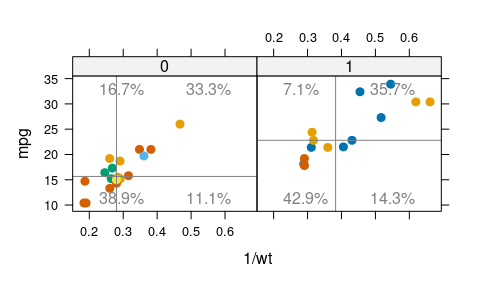<!-- -->

### panel.repellabels

Draw text labels for all points of a scatterplot using internal
functionality from the `ggrepel` package. Note: an alternative panel
function, `panel.directlabels`, carries most of the functionality of
this function, but uses `directlabels` to calculate label positions
instead. The same behavior can be achieved by using `panel.directlabels`
with “ggrepel” for the `positioning` argument.

By default, labels adapt the graphical parameters of the higher level
plot, including coloring according to groups. However, many parameters
can be customized.

``` r
library(grid)
library(lattice)

data("mtcars")
mtcars$car <- rownames(mtcars)

# A standard example using lattice grouping and paneling;
# We can also draw boxes around labels and change label size
xyplot(mpg ~ wt | factor(cyl), mtcars,
  groups = cyl, pch = 19, labels = mtcars$car,
  as.table = TRUE, layout = c(3, 1), cex = 0.6,
  panel = function(x, y, ...) {
    panel.xyplot(x, y, ...)
    panel.repellabels(x, y, draw_box = TRUE, box_line = TRUE, ...)
  }
)
```

<!-- -->

``` r
# A similar plot with panels, but without grouping.
# This requires explicit use of subscripts
xyplot(mpg ~ wt | factor(cyl), mtcars,
  pch = 19, labels = mtcars$car,
  as.table = TRUE, layout = c(3, 1), cex = 0.6,
  panel = function(x, y, subscripts, ...) {
    panel.xyplot(x, y, ...)
    panel.repellabels(x, y, subscripts = subscripts,
      draw_box = TRUE, box_fill = "white", ...)
  }
)
```

<!-- -->

``` r
# An example without panels and more groups
xyplot(mpg ~ wt, mtcars,
  groups = hp, pch = 19,
  labels = mtcars$wt, cex = 0.6,
  panel = function(x, y, ...) {
    panel.xyplot(x, y, ...)
    panel.repellabels(x, y, draw_box = TRUE, box_line = TRUE, ...)
  }
)
```

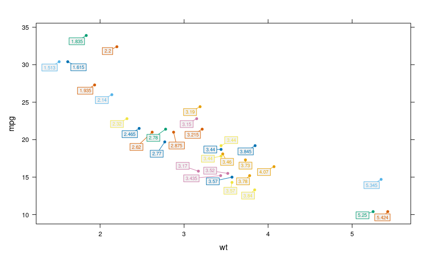<!-- -->

### panel.symbols

Plot a grouping variable encoded by symbols. This panel function allows
to plot one additional grouping variable encoded by symbols (‘pch’)
instead of just the default grouping by color. Inspired by
`panel.bubbleplot` from package `tactile`.

``` r
library(lattice)
data(mtcars)

# first grouping variable for colors, second for symbols (z)
xyplot(mpg ~ factor(cyl), mtcars,
  groups = gear, z = mtcars$cyl,
  panel = function(x, y, z, ...) {
    panel.symbols(x, y, z, ...)
  }
)
```

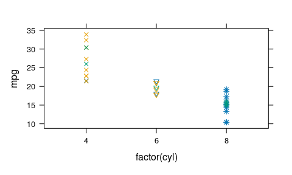<!-- -->

### panel.violinscatter

Combine violin plot and scatter plot. This panel function combines
violin and scatter plot to a violin-shaped scatter plot. By default, the
underlying violin is plotted with the generic `panel.violin` function.
On top of that are the points drawn from which the violin was
calculated. To achieve this, each point is jittered randomly on the X
(Y) axis according to the kernel density estimate of the Y (X) axis. All
parameters that work for `panel.violin` can be used with this function
too (e.g. to control the kernel density function). In addition to that,
this function supports grouping by color and is therefore more flexible
than the canonical `panel.violin`.

``` r
# use singer data from lattice
library(lattice)
data(singer)
singer$voice.part <- gsub(" [12]", "", as.character(singer$voice.part))
singer$voice.part <- factor(singer$voice.part, c("Soprano", "Alto", "Tenor", "Bass"))

# example with grouping
xyplot(height ~ voice.part, singer, groups = voice.part,
  horizontal = FALSE, pch = 19,
  panel = function(x, y, ...) {
    panel.violinscatter(x, y, ...)
})
```

<!-- -->

``` r
# same plot but horizontal orientation
xyplot(voice.part ~ height, singer, groups = voice.part,
  horizontal = TRUE, pch = 19,
  panel = function(x, y, ...) {
    panel.violinscatter(x, y, ...)
})
```

<!-- -->

``` r
# example with more and non-discrete data points
df <- data.frame(
  sample = factor(rep(c("A", "B", "C"), each = 300)),
  variable = c(rnorm(300, 0, 3), rnorm(300, 1, 2), rnorm(300, 3, 3))
)

xyplot(variable ~ sample, df,
  horizontal = FALSE, pch = 19, cex = 0.4,
  panel = function(x, y, ...) {
    panel.violinscatter(x, y, ...)
})
```

<!-- -->

## Other functions

### custom.ggplot

Custom `ggplot2` like theme for lattice plots. Graphical parameters are
passed down to `ggplot2like()`, which passes them down to
`simpleTheme()`.

``` r
library(lattice)
data(mtcars)

xyplot(mpg ~ factor(carb) | gear, mtcars,
  groups = carb, auto.key = list(columns = 3),
  par.settings = custom.ggplot(),
  panel = function(x, y, ...) {
    panel.grid(h = -1, v = -1, col = "white")
    panel.xyplot(x, y, ...)
    panel.lmline(x, y, ...)
  }
)
```

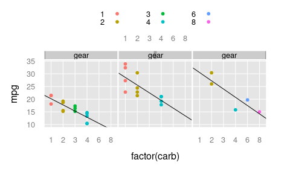<!-- -->

### custom.lattice

Custom grey theme for lattice plots. Some graphical parameters can be
passed to override the defaults. Size parameters are relative.

``` r
library(lattice)
data(mtcars)

xyplot(mpg ~ factor(carb) | gear, mtcars,
  groups = carb, auto.key = list(columns = 3),
  par.settings = custom.lattice(),
  panel = function(x, y, ...) {
    panel.grid(h = -1, v = -1, col = grey(0.95))
    panel.xyplot(x, y, ...)
    panel.lmline(x, y, ...)
  }
)
```

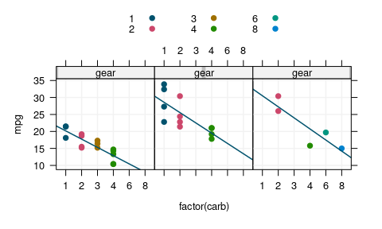<!-- -->

### custom.colorblind

Colorblind-safe grey lattice theme. Colorblind-safe color scale with 7
colors was adapted from R color brewer, see
`RColorBrewer::brewer.pal(8, "Dark2"))`. Color blind safe colors are
distinguishable for most common types of color blindness (deuterotopia,
deuteroanomaly), yet still look good for non color blind people. Some
graphical parameters can be passed to override the defaults. Size
parameters are relative.

``` r
library(lattice)
data(mtcars)

xyplot(mpg ~ factor(carb) | gear, mtcars,
  groups = carb, auto.key = list(columns = 3),
  par.settings = custom.colorblind(),
  panel = function(x, y, ...) {
    panel.grid(h = -1, v = -1, col = grey(0.95))
    panel.xyplot(x, y, ...)
    panel.lmline(x, y, ...)
  }
)
```

<!-- -->

### custom_splom

Custom scatterplot matrix (SPLOM). A wrapper function around lattice
‘splom’ with different upper and lower panels. A scatterplot matrix is a
tiled plot where all variables of a data frame are plotted against each
other.

``` r
library(lattice)
data(mtcars)

# Draw a scatterplot matrix of all variables of a 
# data frame against each other.
custom_splom(mtcars[1:5])
```

<!-- -->

``` r
# We can customize the scatterplot
custom_splom(
  mtcars[1:5],
  col_palette = c("#9FA2FF", "#F1F1F1", "#BAAE00"),
  pscales = 10,
  xlab = "data points", ylab = "regression",
  pch = 1, col = 1, cex = 0.6
)
```

<!-- -->
